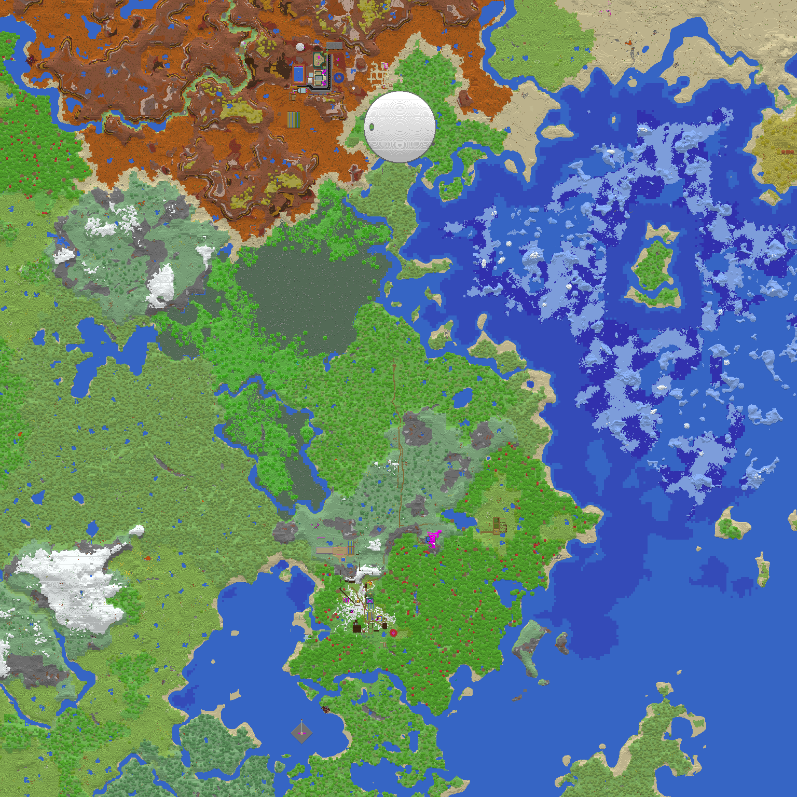

# fastnbt project

![fastnbt-shield]
[![fastnbt-version-shield]][fastnbt-crates]
[![fastnbt-docs-shield]][fastnbt-docs]
[![build-status-shield]][github-actions]

![fastanvil-shield]
[![fastanvil-version-shield]][fastanvil-crates]
[![fastanvil-docs-shield]][fastanvil-docs]

<!-- [![build-status-shield]][github-actions] -->

[fastnbt-shield]: https://img.shields.io/badge/%20-FastNBT-blue
[fastnbt-version-shield]: https://img.shields.io/crates/v/fastnbt.svg
[fastnbt-crates]: https://crates.io/crates/fastnbt
[fastnbt-docs-shield]: https://img.shields.io/docsrs/fastnbt
[fastnbt-docs]: https://docs.rs/fastnbt/latest/fastnbt/index.html
[build-status-shield]: https://img.shields.io/github/actions/workflow/status/owengage/fastnbt/rust.yml?branch=master
[github-actions]: https://github.com/owengage/fastnbt/actions?query=branch%3Amaster
[fastanvil-shield]: https://img.shields.io/badge/%20-FastAnvil-blue
[fastanvil-version-shield]: https://img.shields.io/crates/v/fastanvil.svg
[fastanvil-crates]: https://crates.io/crates/fastanvil
[fastanvil-docs-shield]: https://img.shields.io/docsrs/fastanvil
[fastanvil-docs]: https://docs.rs/fastanvil/latest/fastanvil/index.html

FastNBT is a [serde](https://serde.rs/) serializer and deserializer for
_Minecraft: Java Edition's_ NBT format, including
[`Value`](https://docs.rs/fastnbt/latest/fastnbt/enum.Value.html) type and
[`nbt!`](https://docs.rs/fastnbt/latest/fastnbt/macro.nbt.html) macro.

FastAnvil allows rendering maps of worlds, and a
[`Region`](https://docs.rs/fastanvil/latest/fastanvil/struct.Region.html) for
using the Region file format.

An in-browser Rust-to-WASM powered Minecraft map renderer demo is below.
Supports 1.19 down to 1.15 inclusive. There is also a Tauri desktop UI
application under `app`.

# Demos

Demo of Hermitcraft season 8 and more at [owengage.com/anvil](https://owengage.com/anvil/?world=hermitcraft8)



The `anvil` binary from `fastnbt-tools` can render your world leveraging all of
your CPU.

# Examples

A bunch of examples can be found in
[`fastnbt/examples`](https://github.com/owengage/fastnbt/tree/master/fastnbt/examples),
[`fastanvil/examples`](https://github.com/owengage/fastnbt/tree/master/fastanvil/examples) and [`tools/src`](https://github.com/owengage/fastnbt/tree/master/tools/src/bin). Some examples are recreated below.

# Example: editing level.dat

The following edits the world spawn to 250, 200, 250 (probably not a good
idea!). Full example in fastnbt/examples directory.

```rust
#[derive(Serialize, Deserialize)]
struct LevelDat {
    #[serde(rename = "Data")]
    data: Data,
}

#[derive(Serialize, Deserialize)]
#[serde(rename_all = "PascalCase")]
struct Data {
    spawn_x: i32,
    spawn_y: i32,
    spawn_z: i32,

    #[serde(flatten)]
    other: HashMap<String, Value>,
}

fn main() {
    let args: Vec<_> = std::env::args_os().collect();
    let file = std::fs::File::open(&args[1]).unwrap();
    let mut decoder = GzDecoder::new(file);
    let mut bytes = vec![];
    decoder.read_to_end(&mut bytes).unwrap();

    let mut leveldat: LevelDat = fastnbt::from_bytes(&bytes).unwrap();

    leveldat.data.spawn_x = 250;
    leveldat.data.spawn_y = 200;
    leveldat.data.spawn_z = 250;

    let new_bytes = fastnbt::to_bytes(&leveldat).unwrap();
    let outfile = std::fs::File::create("level.dat").unwrap();
    let mut encoder = GzEncoder::new(outfile, Compression::fast());
    encoder.write_all(&new_bytes).unwrap();
}
```

# Example: print player inventory

This example demonstrates printing out a players inventory and ender chest contents from the [player dat
files](https://minecraft.gamepedia.com/Player.dat_format) found in worlds. We

- use serde's renaming attribute to have rustfmt conformant field names,
- use lifetimes to save on string allocations, and
- use the `Value` type to deserialize a field we don't specify the exact
  structure of.

```rust
#[derive(Deserialize, Debug)]
#[serde(rename_all = "PascalCase")]
struct PlayerDat<'a> {
    data_version: i32,

    #[serde(borrow)]
    inventory: Vec<InventorySlot<'a>>,
    ender_items: Vec<InventorySlot<'a>>,
}

#[derive(Deserialize, Debug)]
struct InventorySlot<'a> {
    id: &'a str,        // We avoid allocating a string here.
    tag: Option<Value>, // Also get the less structured properties of the object.

    // We need to rename fields a lot.
    #[serde(rename = "Count")]
    count: i8,
}

fn main() {
    let args: Vec<_> = std::env::args().skip(1).collect();
    let file = std::fs::File::open(args[0].clone()).unwrap();

    // Player dat files are compressed with GZip.
    let mut decoder = GzDecoder::new(file);
    let mut data = vec![];
    decoder.read_to_end(&mut data).unwrap();

    let player: Result<PlayerDat> = from_bytes(data.as_slice());

    println!("{:#?}", player);
}
```

## Usage

For the libraries

```toml
[dependencies]
fastnbt = "2"
fastanvil = "0.26"
```

For the `anvil` executable

```bash
cargo install fastnbt-tools
```
